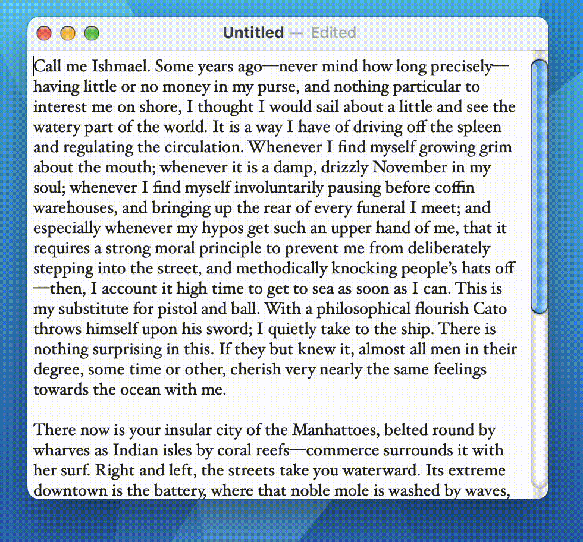

# What is AquaUI?

AquaUI is a love letter to the Macintosh of the Aqua era—with its uncompromising attention to detail, futuristic design, and “lickable” visual style.

# What are our goals?

The goal is not necessarily to recreate 2000s-era Aqua designs pixel by pixel: instead, we aim to imagine how the Aqua design language could have evolved if it had been allowed to do so.

We also aim for AquaUI applications to be good citizens within present-day macOS:

1. We deviate from present-day macOS behaviors mainly when they represent a usability regression.

2. We aim to support both accent colors and light/dark mode.

# Is AquaUI targeting AppKit or SwiftUI?

We take a broad view of current Macintosh platform user interface programming models. There are many things that are currently possible *only* using AppKit (such as window and scrollbar customisation), and on the other hand, there are other things that are much easier using SwiftUI (such as compositional graphics).

AquaUI would ideally provide tools to upgrade the visual appearance of both AppKit and SwiftUI-based controls. For the foreseeable future, there will be gaps in both, but we consider both paradigms to be within the remit of AquaUI.

We also use SwiftUI at times as an implementation detail when constructing visuals for use within AppKit; for example, the Aqua scroller knob is currently backed by SwiftUI.

# How can I contribute?

Contributions are extremely welcome. You will find that current implementations have various limitations, and we very sincerely hope that contributors will feel free to lift these limitations. Visual customisation in AppKit is a bit of a dark art: contributions that improve the correctness and stability of the customisations are welcome.

Visual design is a matter of both taste *and* ability. Contributions that improve the visual design in line with the project vision are welcome.

# Can I use AquaUI in my application?

AquaUI is [licensed permissively](LICENSE), because we want it to be as widely usable as possible.
